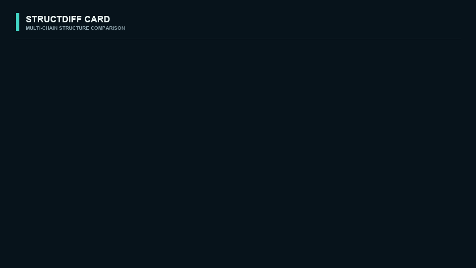

# StructDiff Card

**Explain where two macromolecular structures differ—with a residue-colored 3D
map, contact changes, motion decomposition, 3D difference patches, and no hidden
unequal chains or gaps.**

[](https://github.com/jwliaomath/StructDiff-Card/actions/workflows/tests.yml)
[](https://jwliaomath.github.io/StructDiff-Card/)
[](LICENSE)

[Open the interactive static gallery](https://jwliaomath.github.io/StructDiff-Card/) ·
[Method and interpretation](docs/method.md) ·
[Report an issue](https://github.com/jwliaomath/StructDiff-Card/issues)



The GitHub Pages site above is a complete **precomputed** result: a difference-colored
3D overlay, high-residual vectors, coherent-region table, chain mapping,
per-residue displacement, unmatched-chain/gap track, publication card, and
downloadable CSV/SVG/PDB. It never accepts uploads. Run the app locally when
comparing private or unpublished structures.

## Run locally in one command

```bash
docker run --rm -p 8501:8501 ghcr.io/jwliaomath/structdiff-card:latest
```

Open <http://localhost:8501>. No GPU or API key is required. Suggested baseline:
2 CPU, 2–4 GB RAM, and about 1 GB free disk.

Until the first GHCR release is published, clone the repository and use the
same one-command workflow from source:

```bash
docker compose up --build
```

Docker Desktop (the Docker engine) must be running while the app container is
running. The image survives after the container stops, so normal later starts do
not reinstall Python packages or recompile US-align. Rebuild only after the source,
Dockerfile, or dependencies change. The `--rm` flag removes the stopped container,
not the reusable image.

## Why this is not “just Kabsch”

Kabsch only requires equal numbers of **paired anchors**. The difficult step is
deciding which residues—and, for assemblies, which chains—correspond when total
counts differ. StructDiff Card therefore:

1. uses [US-align](https://github.com/pylelab/USalign) to establish structural
   correspondence and chain assignment;
2. applies one global transform to the complete mobile assembly;
3. calculates per-residue displacement only for mapped representative atoms;
4. reports unmatched chains and gap rows instead of inventing distances; and
5. shows TM-score normalization, coverage, command, engine version, and input
   SHA-256 alongside RMSD.

For proteins the default representative atom is C-alpha; for RNA/DNA it is
C3-prime. Ligands move with the global structure but are not advertised as
general alignment anchors.

## Outputs

Every comparison writes a reproducible bundle:

| File | Purpose |
| --- | --- |
| `result.json` | Full metrics, transform, chain and residue mapping, hashes |
| `difference_summary.json` | Median, 90th percentile, maximum and adaptive threshold |
| `difference_hotspots.csv` | Coherent high-residual regions with context and peak residues |
| `contact_changes.csv` | Stable gained/lost residue contacts, distances, and chain-interface flag |
| `contact_summary.json` | Contact cutoff, transition margin, and change counts |
| `motion_decomposition.csv` | Per-chain rigid-body and internal RMSD components |
| `spatial_patches.csv` | High-residual residues clustered by 3D proximity |
| `chain_mapping.csv` | Per-chain TM-scores, RMSD, identity, coverage |
| `residue_mapping.csv` | Matched/gap rows, displacement and 3D residual vector |
| `mobile_aligned_to_reference.pdb` | All mobile atoms after the global transform |
| `mobile_aligned_difference.pdb` | Aligned mobile with residual distance in B-factor; unmatched = -1 |
| `view_difference.pml` | PyMOL recipe for the same blue–white–red difference map |
| `per_residue_displacement.svg` | Editable vector plot |
| `publication_card.svg` | Shareable summary with interpretation context |
| `usalign_stdout.txt` | Raw engine output for auditability |

## CLI and Python API

Install US-align with Bioconda/Homebrew, or point to an executable:

```bash
conda install -c bioconda usalign
uv sync --extra dev
uv run structdiff doctor
```

Compare two coordinate files:

```bash
uv run structdiff compare model.cif reference.pdb -o result
```

Use a biological assembly encoded across PDB models and override an ambiguous
chain mapping:

```bash
uv run structdiff compare model.pdb reference.pdb \
  --assembly biological --chain-map A:C,B:D -o result
```

Python:

```python
from structdiff_card import compare_structures
from structdiff_card.export import write_bundle

result = compare_structures("model.cif", "reference.pdb")
write_bundle(result, "model.cif", "reference.pdb", "result")
print(result.summary.tm_reference, result.unmatched_mobile_chains)
```

## The bundled example

The static gallery compares human deoxyhemoglobin **2HHB** against the two-chain
crystallographic asymmetric unit of oxyhemoglobin **1HHO**. US-align maps
`2HHB:C → 1HHO:A` and `2HHB:D → 1HHO:B`; 2HHB chains A/B remain unmatched.

This is intentional. It demonstrates that a high reference-normalized TM-score
(`0.982`) and low aligned RMSD (`0.89 Å`) can coexist with an assembly mismatch.
Before interpreting conformational change, check whether both files represent
the same biological assembly.

## Reading the difference map

- Blue residues are close to the paired reference position; red residues approach
  or exceed 5 Å after the single global fit.
- Yellow 3D spokes connect paired representative atoms above the adaptive hotspot
  threshold and therefore show both magnitude and direction.
- A hotspot is a run of nearby high-residual residues expanded by two aligned
  residues on each side. It is more robust than reporting only the largest atom.
- The threshold is `max(2 Å, 90th percentile)`, so the table remains selective
  while retaining an absolute structural scale.
- These are localization aids, not automatic evidence of flexibility or mechanism.

## Three complementary structural diagnostics

- **Contact changes:** a representative-atom pair is a contact at ≤8 Å. Gained or
  lost calls require the other structure to be ≥9 Å, which prevents tiny cutoff
  fluctuations from dominating. Immediate same-chain sequence neighbors are omitted.
- **Rigid-body vs internal:** after the one complex-level fit, each mapped chain is
  locally refitted only as a diagnostic. The RMSD improvement is the rigid-body
  component; the remaining local-fit RMSD is internal deformation. The main residual
  map is never replaced by this local fit.
- **3D spatial patches:** high-residual residues within 10 Å in the reference frame
  form one patch, even when they are non-contiguous in sequence or cross a chain
  interface.

## Scientific guardrails

- `-mm 1` means pairwise multi-chain macromolecular assembly alignment. It is
  not arbitrary atom-level alignment of ligands, glycans, lipids, and ions.
- Chain assignment is heuristic. Symmetric homo-oligomers may have several
  equivalent mappings; inspect or override the table.
- Per-residue displacement is a residual after the selected global fit. A peak
  does not by itself prove flexibility or mechanism.
- TM-score and RMSD must be read with aligned length and coverage.
- “First model / asymmetric unit” and “all models / biological assembly” are
  coordinate-file choices, not automatic biological truth.

More detail: [docs/method.md](docs/method.md).

## Reproducibility

The Docker build compiles the vendored official single-file US-align source and
checks SHA-256 `5e05ddcd…d8913f5` before compilation. The result bundle records
the detected US-align version, command, and hashes of both inputs. See
[source provenance](vendor/USalign/README.md) and
[third-party notices](THIRD_PARTY_NOTICES.md).

## Development

```bash
uv sync --extra dev
export USALIGN_BIN=/path/to/USalign
uv run pytest
uv run streamlit run app.py
```

Static gallery:

```bash
cd site
pnpm install --frozen-lockfile
pnpm dev
```

The project is MIT licensed. US-align and 3Dmol.js retain their own licenses and
citation requirements.